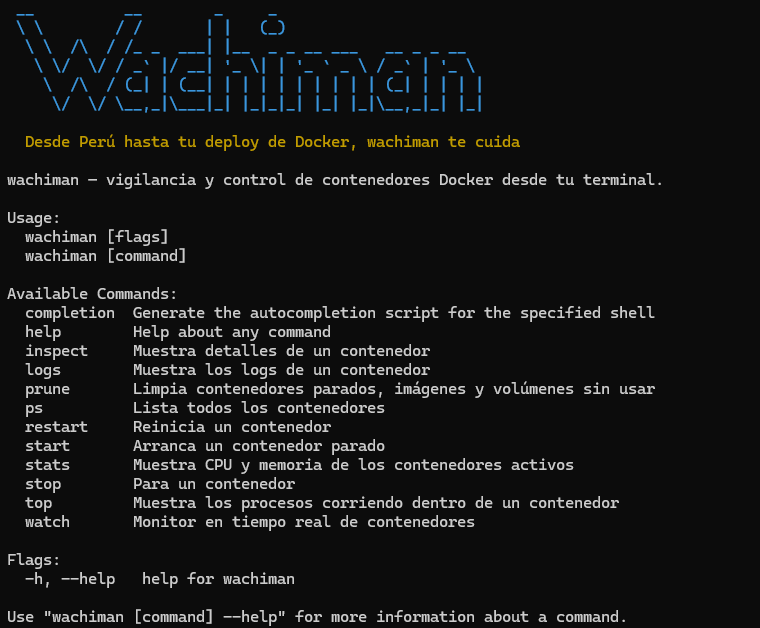

# Wachiman CLI

> CLI hecho mientras hacia una capacitación — desde Perú hasta tu deploy.

Herramienta CLI escrita en Go para monitorear y gestionar contenedores Docker desde tu terminal. Soporta monitoreo en tiempo real, estadísticas de recursos, inspección de procesos y gestión del ciclo de vida de contenedores.



---

**Última versión:** [v0.2.0](https://github.com/x-name15/wachiman-cli/releases/tag/0.2.0)


## Requisitos

- Go 1.21+
- Docker Desktop o Docker Engine corriendo localmente

---

## Instalación

**Build local:**
```bash
go build -o wachiman .
```

**Instalación global** (añade `wachiman` a tu PATH via `$GOPATH/bin`):
```bash
go install .
```

**Windows:**
```bash
go build -o wachiman.exe .
```

---

## Comandos

### `ps` — Lista contenedores

```bash
wachiman ps                  # todos
wachiman ps --running        # solo los que están corriendo
wachiman ps --stopped        # solo los parados
```

```
CONTAINER ID   NAME            IMAGE                    STATUS         PORTS
90bded73ff72   wordpress_app   wordpress:6.9.4-php8.4   Up 2 hours     8080->80
4b772b81b3a8   wordpress_db    mariadb:latest           Up 2 hours     3306->3306
```

---

### `stats` — CPU y memoria

```bash
wachiman stats
```

```
NAME            CPU %                  MEM USED    MEM LIMIT   MEM %
wordpress_app   ██░░░░░░░░  0.06%     14.62 MB    7.66 GB     ░░░░░░░░░░  0.19%
wordpress_db    ████░░░░░░  0.35%     94.31 MB    7.66 GB     █░░░░░░░░░  1.20%
```

Colores: 🟢 menos de 50% · 🟡 50–80% · 🔴 más de 80%

---

### `watch` — Monitor en tiempo real

```bash
wachiman watch               # se refresca cada 3 segundos (por defecto)
wachiman watch --interval 5  # intervalo personalizado en segundos
wachiman watch -i 10
```

Muestra un dashboard en vivo con estado de contenedores, barras de CPU y uso de memoria. Presiona `Ctrl+C` para salir.

---

### `logs` — Logs de un contenedor

```bash
wachiman logs wordpress_app             # últimas 50 líneas (por defecto)
wachiman logs wordpress_app --tail 100
wachiman logs wordpress_app -t 20
```

---

### `inspect` — Detalles de un contenedor

```bash
wachiman inspect wordpress_app
```

Muestra IP, puertos expuestos, volúmenes montados y variables de entorno.

---

### `top` — Procesos dentro de un contenedor

```bash
wachiman top wordpress_app
```

```
PID    COMMAND                CPU %   MEM %
759    apache2 -DFOREGROUND
801    apache2 -DFOREGROUND
```

---

### `start` / `stop` / `restart`

```bash
wachiman start wordpress_app
wachiman stop wordpress_app
wachiman restart wordpress_app
```

---

### `prune` — Limpia recursos sin usar

Elimina contenedores parados, imágenes sin usar y volúmenes huérfanos.

```bash
wachiman prune        # pide confirmación
wachiman prune -f     # sin confirmación
wachiman prune --force
```

>  Esta operación es irreversible. Usa `--force` con cuidado.

---

## Construido con

- [cobra](https://github.com/spf13/cobra) — framework para CLIs en Go
- [moby/moby](https://github.com/moby/moby) — SDK oficial de Docker para Go
- [fatih/color](https://github.com/fatih/color) — colores en terminal

---

## Licencia

GNU GENERAL PUBLIC LICENSE Version 3

---

## Changelog

Se añadió un registro de cambios (changelog) a este `README.md`. Consulta la última versión y notas de la release en:
- [v0.1.0 - CHANGE LOG](CHANGELOG.md)
- [v0.1.0 - Release notes](https://github.com/x-name15/wachiman-cli/releases/tag/0.1.0)
